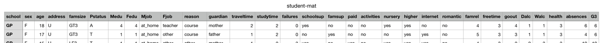

## Minimal Viable Product (MVP) Summary

### Problem:
Classifying students' grades into Pass / Fail

#### Description:
Predicting student's mathematics and Portuguese language grade based on various features, such as:
sex, age, relationship status, alcohol consumption, etc. In total 30 different features are available, appropriate ones will be selected using data analysis.

### Why?
Understanding how different characteristics, family situations and choices in life affect ones learning (through grades) can be very powerful. Especially when talking about youth education. If more schools did such data collection and analysis, we would probably have a much better education programs catered to different groups of students.
Moreover, actual science based information could be passed on to the parents who could, in turn, make smarter decisions for their children / teenagers.
As a side note, I have a *(strong)* opinion that drinking alcohol has a negative impact on learning. It would be interesting to see if that is, indeed, the case in a more scientific way rather than just from personal experience.

Overall, This is not so much of a business problem, but rather a social responsibility question.  
*In terms of domain knowledge, I don't have any specific knowledge other than my, my family's and friends' experience*

### Dataset

[Data source](http://archive.ics.uci.edu/ml/datasets/Student+Performance#)

### Known Unknowns

* What relationship does alcohol consumption have with student's grades?
* What impact does being in a relationship have on student's grades?
* Is there a difference between the impact features have on math grades versus those of language skills (Portuguese)?
* How features like alcohol consumption correlate with age or relationship status?
* How does the family size or parent cohabitation impact student's grades?
* What relationship do extra-curricular activities have with alcohol consumption?
* Many more...

### Feedback
Some questions and thoughts:
**- What is your *minimum* viable product? What are you simplifying in your model as a first iteration?**   
      *My minimum viable product is predicting a Fail or Pass, using the two datasets*
**- What is the label you are trying to predict?**   
      *I will be transforming the G3 (Final grade column) into Pass / Fail and predicting that*
**- It looks like there are encoded values in your data, e.g., `famsize=GT3` do you have a dictionary lookup of what these actually mean?**   
      *Yes, I have a dictionary for all the values at the location where I got the datasets*
**- How many observations are in the dataset?**   
      *There are 395 observations for math score and another 649 for Portuguese score. I will be combining the two datasets*
**- What is the age range of the students?**   
      *The age range is 15 to 22*
**- Do you have any information in the data regarding when they started drinking or dating?**   
      *No, just how much they drink per weekday and per weekend (on the scale from 0 to 5)*
**- It is likely you will have to group certain similar professions together to reduce the number of categorical values in the data.**   
      *I won't be using all the features in my modelling, but I will only know which ones I'll use after the analysis*
**- You have very few "real" numerical features to work with. Explore the data and make reasonable assumptions on which columns have hard numbers and which have been encoded to some numerical value.**   
      *Do I have to have many numerical values? Is having encoded / dummified variables an issue? What could my problems be if I use many encoded values and only 2 or 3 numerical ones?*
