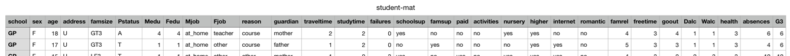

## Student Grade Classification

### Problem:
Classifying students' grades into Pass / Fail

#### Description:
Predicting student's mathematics and Portuguese language grade based on various features, such as:
sex, age, relationship status, alcohol consumption, etc. In total 30 different features are available, appropriate ones will be selected using data analysis.

### Why?
Understanding how different characteristics, family situations and choices in life affect ones learning (through grades) can be very powerful. Especially when talking about youth education. If more schools did such data collection and analysis, we would probably have a much better education programs catered to different groups of students.
Moreover, actual science based information could be passed on to the parents who could, in turn, make smarter decisions for their children / teenagers.
As a side note, I have a *(strong)* opinion that drinking alcohol has a negative impact on learning. It would be interesting to see if that is, indeed, the case in a more scientific way rather than just from personal experience.

Overall, This is not so much of a business problem, but rather a social responsibility question.  
*I don't have any specific knowledge other than my, my family's and friends' experience*

### Plan of Action:

1. Clearly define the question - :thumbsup:
2. Get a good quality dataset (ideally multiple) - :thumbsup: :thumbsup:
3. Transform the data to reflect the question (convert final grades to labels (Pass / Fail)) :thumbsup:
4. Store the data in SQL database tables :thumbsup:
5. Combine the two datasets (using SQL UNION) :thumbsup:
6. Explore and analyse the dataset(s) :thumbsup:
7. Clean missing values, outliers (if any) and obvious mistakes :thumbsup:  
8. Transform the variables (dummify, etc.) *Because my dataset is imbalanced (0.8 vs 0.2, I should look into imblearn module to RandomOversampling or use SMOTE to oversample the minority class (Fail))* :thumbsdown: :confused:
9. Select initial features *using RandomForest* :thumbsup:
10. Model using different models (KNN, Logistic Regression, Decision Trees, Random Forest, SVC, etc.) *suggestion from Damien to try SVM / SVC, RandomForest and LogisticRegression. If there's time, try clustering for some of the features and then apply the above mentioned models)* :thumbsup:
11. Check accuracy, recall, precision, f1 :thumbsup:
12. Plot roc_curve and get roc_auc scores :thumbsup:
13. Refine feature selection and repeat above steps :thumbsup:
14. Create online interface using Flask :thumbsup:
15. Visualize the results :thumbsup:
16. Create the presentation *almost* :thumbsup:
17. This time actually practice presenting :smirk:

### About The Dataset

**Number of datasets:** 2  
**Format**: CSV  
**Total observations:** 395 + 649  
**Missing values:** N/A  
**Dataset makeup:** 33 variables: 9 categorical, 8 boolean, 10 encoded, 6 numerical  
**Target variable (label):** Transformed G3 (final grade) (Pass / Fail)  
**Features to be excluded:** G1 and G2 (first and second semester grades)  
**Added features:** Grade type (Maths / Portuguese)  
**Dummified features:**   
**Dropped features after Random Forest analysis:**   

[Data source](http://archive.ics.uci.edu/ml/datasets/Student+Performance#)

### Known Unknowns:

* What relationship does alcohol consumption have with student's grades?
* What impact does being in a relationship have on student's grades?
* Is there a difference between the impact features have on math grades versus those of language skills (Portuguese)?
* How do features like alcohol consumption correlate with age or relationship status?
* How does the family size or parent cohabitation impact student's grades?
* What relationship do extra-curricular activities have with alcohol consumption?

### Data analysis

* Figured out the hyper-parameters for 6 different models :thumbsup:  
* Compared all the models with their best hyper-parameters (SGB did the best on Cross Validation comparing accuracy score) :thumbsup:  
* Random Forest was showing signs of overfitting initially, but after adding min_samples_leaf limit to 3, the score improved.  
* Tried oversampling (using Random, SMOTE and ADASYN), didn't help, need to look into it more :thumbsup:  
* Need to do forward feature selection (**15 features left**) :thumbsup:
  1. Failures
  2. Discipline
  3. Absences
  4. Going out
  5. Willingness to Pursue Higher Education
  6. Father's education
  7. Studying time
  8. Family relationship
  9. Weekend alcohol consumption
  10. Mother's education
  11. Health
  12. Free time
  13. Age
  14. Whether paying for school or not
  15. Living in the city or not
* Oversamping did not help (proved with Random Forest and Naive Bayes (Bernoulli))
* Final precision score on the test set was **~0.86**, final AUC score is **~0.67**
